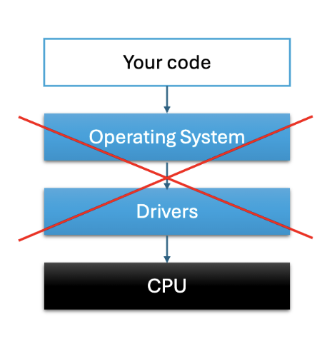
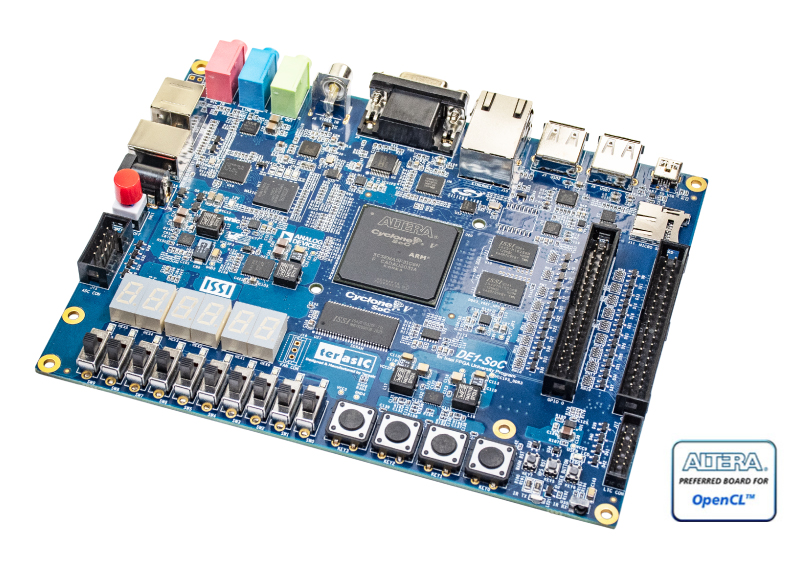
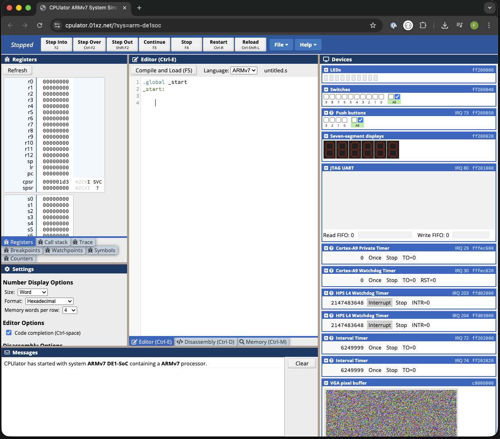
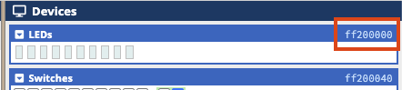
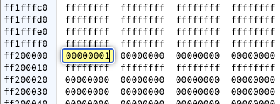
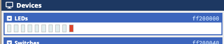
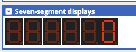
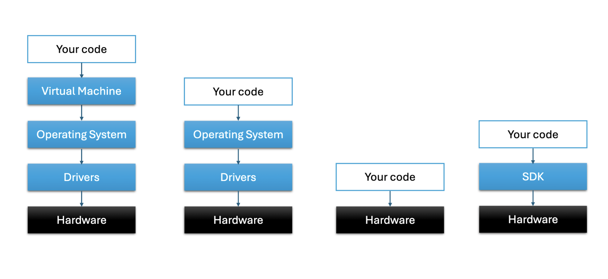

# Baremetal programming

---

#### No Drivers, No Operating System


Inspired by Olve Maudal's brilliant "Introduction to Bare Metal Coding" mini-course.



---

##### Exercise: Ultra-low-power "smart collar" for sheep


---

## Why do it?

- Demystify assembly and low level programming
- See if we can use a LLM to help us learn something new
- Most likely new for everyone
- Why not - It is different, it has potential to be fun.

---

#### ARM DE1-SoC
[https://cpulator.01xz.net/?sys=arm-de1soc](https://cpulator.01xz.net/?sys=arm-de1soc)

[https://cpulator.01xz.net/?sys=arm-de1soc](https://cpulator.01xz.net/?sys=arm-de1soc)

---

## Hello World! 

What is the first program you always write in a new language?


In embedded programming we typically start by blinking a LED.

--

[https://cpulator.01xz.net/?sys=arm-de1soc](https://cpulator.01xz.net/?sys=arm-de1soc)



--







--

## Assembly program

```assembly
.global _start

.equ LEDR_BASE, 0xFF200000

_start:
    ldr     r0, =LEDR_BASE

blink_loop:
    mov     r1, #1
    str     r1, [r0]
    mov     r1, #0
    str     r1, [r0]
    b       blink_loop
```

--

## C Program

```c
#include <stdint.h>

volatile uint32_t * LEDR = (uint32_t*)0xFF200000;

int main(void)
{
	while (1) {
        *LEDR = 0x1;
		*LEDR = 0x0;
	}
}
```

---

## DE1-SoC simulator, part two

Add a delay to make LED blink

```assembly
.global _start

.equ LEDR_BASE, 0xFF200000

_start:
    ldr     r0, =LEDR_BASE

blink_loop:
    mov     r1, #1
    str     r1, [r0]
    bl      delay

    mov     r1, #0
    str     r1, [r0]
    bl      delay

    b       blink_loop

delay:
    ldr     r2, =10000000

waitloop:
    sub     r2, #1
    cmp     r2, #0
    bne     waitloop
    bx      lr
```

--

## C

```c
#include <stdint.h>

volatile uint32_t * LEDR = (uint32_t*)0xFF200000;

void wait(void) {
    volatile int i;
    for (i = 0; i < 3000000; i++);
}

int main(void)
{
	while (1) {
        *LEDR = 0x1;
		wait();
		*LEDR = 0x0;
		wait();
	}
}
```

--

##### Do you see any problems with our current implementation?

--

```assembly
.global _start

.equ LEDR_BASE, 0xFF200000

_start:
    ldr     r0, =LEDR_BASE

blink_loop:
	ldr     r3, [r0]
	orr     r3, r3, #1
    str     r3, [r0]
    bl      delay

	ldr     r3, [r0]
	bic     r3, r3, #1
    str     r3, [r0]
    bl      delay

    b       blink_loop

delay:
    ldr     r2, =10000000

waitloop:
    sub     r2, #1
    cmp     r2, #0
    bne     waitloop
    bx      lr
```

--

```c
#include <stdint.h>

volatile uint32_t * LEDR = (uint32_t*)0xFF200000;

void wait(void) {
    volatile int i;
    for (i = 0; i < 3000000; i++);
}

int main(void)
{
	while (1) {
        *LEDR |= 0b1;
		wait();
		*LEDR &= ~0b1;
		wait();
	}
}
```

--

### We can also flip bits with XOR

```assembly

.global _start

.equ LEDR_BASE, 0xFF200000

_start:
    ldr     r0, =LEDR_BASE

blink_loop:
	ldr		r3, [r0]
	eor		r3, r3, #1
    str     r3, [r0]
    bl      delay

    b       blink_loop

delay:
    ldr     r2, =10000000

waitloop:
    sub     r2, #1
    cmp     r2, #0
    bne     waitloop
    bx      lr
```

--

```c
#include <stdint.h>

volatile uint32_t * LEDR = (uint32_t*)0xFF200000;

void wait(void) {
    volatile int i;
    for (i = 0; i < 3000000; i++);
}

int main(void)
{
	while (1) {
        *LEDR ^= 0b1;
		wait();
	}
}
```

---

## DE1-SoC simulator, part three

Reading switches from memory-mapped I/O and turn on LEDs

```assembly
.global _start

.equ LEDR_BASE, 0xFF200000
.equ SW_BASE, 0xFF200040

_start:
    ldr     r0, =LEDR_BASE
    ldr     r4, =SW_BASE

switch_loop:
    ldr     r3, [r4]
    str     r3, [r0]

    b       switch_loop

```

---

## DE1-SoC simulator, part four

7 segment display

--

Let's try writing 3f to f200020



--

Similar to before, we can now do the same in c:

```c
#include <stdint.h>

volatile uint32_t * LEDS = (uint32_t*)0xFF200020;

int main(void)
{
    *LEDS = 0x3f;
	while (1) {
	}
}
```

--

There are many different patterns. Let's see if a LLM can help us find the rest:

Prompt: I am using the ARM DE1SoC dev board. Please write a lookup table I can use to write to the 7 segment displays

--

```c
const unsigned char seven_seg_lookup_active_high[16] = {
    0x3F, // 0
    0x06, // 1
    0x5B, // 2
    0x4F, // 3
    0x66, // 4
    0x6D, // 5
    0x7D, // 6
    0x07, // 7
    0x7F, // 8
    0x6F, // 9
    0x77, // A
    0x7C, // b
    0x39, // C
    0x5E, // d
    0x79, // E
    0x71  // F
};
```

--

```c
#include <stdint.h>

volatile uint32_t * LEDS = (uint32_t*)0xFF200020;
volatile uint32_t * BUTTONS = (uint32_t*)0xFF200050;

const unsigned char seven_seg_lookup_active_high[16] = {
    0x3F, // 0
    0x06, // 1
    0x5B, // 2
    0x4F, // 3
    0x66, // 4
    0x6D, // 5
    0x7D, // 6
    0x07, // 7
    0x7F, // 8
    0x6F, // 9
    0x77, // A
    0x7C, // b
    0x39, // C
    0x5E, // d
    0x79, // E
    0x71  // F
};


void wait(void) {
    volatile int i;
    for (i = 0; i < 3000000; i++);
}


int main(void)
{
	while (1){
		while (*BUTTONS == 0);
		for (int i = 9; i >= 0; i--)
		{
			*LEDS = seven_seg_lookup_active_high[i];
			wait();
		}
	}
}
```

---



---

## Time to hack!

In groups of about four people, identify a problem and design a product to solve it. Use the cpulator to prototype your product.

Humor is appreciated, both in the problems and the solutions. Feel free to imagine peripheral devices such as sensors and actuators connected to the virtual dev board.

At 15:00 we regroup and present the products to each other.
