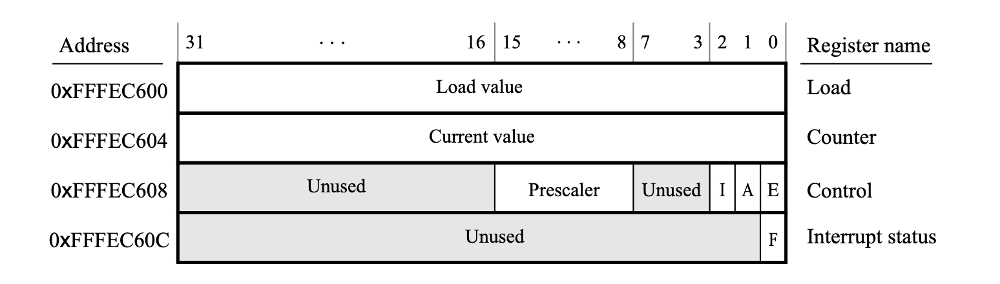

# Timer

The ARM A9 core incudes a private timer module that you can interact with in the simulator.

- At base address `0xFFFEC600` in memory.
- You can read and write to it.
- To use a timer:
    - Write initial count value into **Load**
    - Current value can be read by code by reading **Counter**
    - Start and stop timer by enable bit `E` in **Control**.
    - When enabled, timer will decrement until it reaches zero.
    - At zero it sets the `F` bit in the **Interrupt status**.
    - Code can check `F` bit by polling when timer period has expired.
    - Timer has a clock frequency of 200 MHz.
    - **Prescaler** field in the **Control** register can slow down counting rate.
    - `A` bit will have timer immediately start over and decrement from count value in **Load**



Example show how to target the different registers in memory.

```assembly
LDR R0, =0xFFFEC600
STR R1, [R0] // Load
STR R2, [R0, #0x8] // Control
STR R3, [R0, #0xC] // Interrupt status
```

Full example showing configuring timer, and wait for it to complete

```assembly
.equ TIMER_BASE, 0xFFFEC600
.equ LED_BASE,   0xFF200000

.global _start

_start:
  LDR R0, =LED_BASE
  MOV R2, #0b0
  LDR R1, =TIMER_BASE
  LDR R3, =200000000
  STR R3, [R1]
  MOV R3, #0b011
  STR R3, [R1, #0x8] // Store pattern in R3 0xFFFEC608. Sets E and A.

loop:
  STR R2, [R0]

wait:
  LDR R3, [R1, #0xC] //Load word at 0xFFFEC60C with F flag into R3. When F flag is 1, the timer has expired.
  CMP R3, #0
  BEQ wait

  STR R3, [R1, #0xC]
  EOR R2, R2, #0b1
  B loop
```
