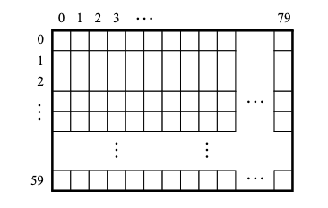

# Display characters in the VGA display

The onboard VGA controller has a character buffer, that allows writing characters in a resolution of 80x60 characters across the screen. Each character occupies a 8x8 block of pixels on the screen. The buffer is memory-mapped from memory address `0xC9000000`. Each address can store an ASCII code that will be displayed by the monitor.
Converting ASCII to pixels on the monitor is done automatically by the controller.

- The screen can display 80x60 characters.



- Each pixel is represented as an 8 bit value (1 byte) in ASCII
- character positions are addressed in the character buffer by
  using the combination of a base address and an x,y offset.
    - Base address `0xC9000000`
        - Character (1,1): `000001 0000001`
        - Character (1,0): `000000 0000001`
        - Character (0,1): `000000 0000001`
        - Character (2,1): `000001 0000002`
    - So to write character to position:

```assembly
 .global _start
  _start:
    LDR R2, =0xC9000000 //base-address
    MOV R1, #0 // y-coordinate
    MOV R0, #0 // x-coordinate
    LDR R3, =65 // Uppercase A ASCII code
    ADD R2, R2, R1, LSL #7 //Add y-coordinate shifted 7 to the left to the base-address
    ADD R2, R2, R0 // Add x-coordinate to (base-address+y-coordinate)
    STRB R3, [R2] // Write char to address in r2, (writes byte , 8 bits)
```

## Task - Draw the letter B on screen at y=5 and x=12

<details>
  <summary>Click for a solution</summary>

```assembly
.global _start

.equ CHAR_BASE, 0xC9000000
.equ LETTER_B, 66

_start:
  LDR R2, =CHAR_BASE
  MOV R1, #5
  MOV R0, #12
  LDR R3, =LETTER_B
  ADD R2, R2, R1, LSL #7
  ADD R2, R2, R0
  STRB R3, [R2]

main:
  B main
```

</details>

## Task - Draw the the word WOW on screen

- create a subroutine `draw_char` that is called from `_start`
- Useful instructions are `BL` and `BX LR` to call a subroutine and return to the next instruction in the parent function.
- Try to use `PUSH {R2}` and `POP {R2}`, to store and restore **base_address** when calling a  subroutine.
- `draw_char` would in this task be called three times to display the word **WOW**.

<details>
  <summary>Click for a solution</summary>

```assembly
.global _start

.equ CHAR_BASE, 0xC9000000
.equ LETTER_W, 87
.equ LETTER_O, 79

_start:
  LDR R2, =CHAR_BASE
  MOV R0,#30
  MOV R1,#30
  LDR R3, =LETTER_W
  BL draw_char
  ADD R0, R0,#1
  LDR R3, =LETTER_O
  BL draw_char
  ADD R0, R0,#1
  LDR R3, =LETTER_W
  BL draw_char

main:
  B main

draw_char:
  PUSH {R2}
  ADD R2, R2, R1, LSL #7
  ADD R2, R2, R0
  STRB R3, [R2]
  POP {R2}
  BX LR
```

</details>

## Task - Draw the the word EQUINOR on screen

You now have a slightly longer word, and it is time to adjust from loading each and every ASCII char to loading a word (several ASCII bytes together).

- Use the `.asciz`directive to define a null-terminated string in memory. A null byte is appended at the end of the string, which is useful to determine when you have looped through the string in code.
- `.string` can also be used, and is an alias for `.asciz`
- `LDRB R4, [R3], #1`, loads a byte at address stored in R3 into R4 and increment R3 by one.
- `CMP R4, #0`, compares content of R4 with zero. Useful when looping to check if the string has terminated. Follow this with for instance the `BLNE draw_char`. `BLNE`, will branch if the conditional flags indicate that previous `CMP` was not equal to zero.
- Since you probably are calling a `draw_string` subroutine which calls another subroutine `draw_char`, you will have to manage the `LR` link register. To do so store and restore `LR` in `draw_string` with `PUSH {LR}` and `POP {LR}` to the stack. It depends a bit on how you set up the looping in `draw_string`.

<details>
  <summary>Click for a solution</summary>

```assembly
.global _start

.equ CHAR_BASE, 0xC9000000
equinor_string:
  .asciz "Equinor"

_start:
  LDR R2, =CHAR_BASE
  MOV R0,#5
  MOV R1,#30
  LDR R3, =equinor_string
  BL draw_string

main:
  B main

draw_string:
  LDRB R4, [R3], #1
  CMP R4, #0
  PUSH {LR, R2}
  BLNE draw_char
  POP {LR, R2}
  ADD R0, R0, #1
  BNE draw_string
  BX LR

draw_char:
  ADD R2, R2, R1, LSL #7
  ADD R2, R2, R0
  STRB R4, [R2]
  BX LR
```

</details>

<details>
  <summary>Click for a solution using recursion</summary>

```assembly
.global _start

.equ CHAR_BASE, 0xC9000000
equinor_string:
  .asciz "Equinor"

_start:
  LDR R2, =CHAR_BASE
  MOV R0,#5
  MOV R1,#30
  LDR R3, =equinor_string
  BL draw_string

main:
  B main

draw_string:
  LDRB R4, [R3], #1
  CMP R4, #0
  BEQ end_draw_string //Exit when null byte reached
  PUSH {R0, R3,R2, LR} // Store registers before calling subroutine
  BL draw_char
  POP {R0, R3, R2, LR} // Restore registers after subroutine returns
  ADD R0, R0, #1
  B draw_string // Call itself without setting LR, link_register

end_draw_string:
    BX LR

draw_char:
    ADD R2, R2, R1, LSL #7
    ADD R2, R2, R0
    STRB R4, [R2]
    BX LR
```

</details>

<details>
  <summary>Click for a solution using BEQ instead of BNE</summary>

Use BEQ to call end routine to end subroutine

```assembly
.equ CHAR_BASE, 0xC9000000
equinor_string:
  .asciz "Equinor"

_start:
  LDR R2, =CHAR_BASE
  MOV R0,#5
  MOV R1,#30
  LDR R3, =equinor_string
  BL draw_string

main:
  B main

draw_string:
  LDRB R4, [R3], #1
  CMP R4, #0
  BEQ draw_string_end
  PUSH {LR, R2}
  BL draw_char
  POP {LR, R2}
  ADD R0, R0, #1
  B draw_string

draw_string_end:
  BX LR

draw_char:
  ADD R2, R2, R1, LSL #7
  ADD R2, R2, R0
  STRB R4, [R2]
  BX LR
```

</details>

<details>
  <summary>Click for a solution without subroutine calling subroutine</summary>

```assembly
.equ CHAR_BASE, 0xC9000000
equinor_string:
  .asciz "Equinor"

_start:
  LDR R2, =CHAR_BASE
  MOV R0,#5
  MOV R1,#30
  LDR R3, =equinor_string
  BL draw_string

main:
  B main

draw_string:
  LDRB R4, [R3], #1
  CMP R4, #0
  BEQ draw_string_end
  PUSH {R2}
  // draw char
  ADD R2, R2, R1, LSL #7
  ADD R2, R2, R0
  STRB R4, [R2]
  // end draw char
  POP {R2}
  ADD R0, R0, #1
  B draw_string

draw_string_end:
  BX LR
```

</details>

<details>
  <summary>Click for a solution without using the stack</summary>

```assembly
.equ CHAR_BASE, 0xC9000000
equinor_string:
  .asciz "Equinor"

_start:
  LDR R2, =CHAR_BASE
  MOV R0,#5
  MOV R1,#30
  LDR R3, =equinor_string
  BL draw_string_start

main:
  B main

draw_string_start:
  ADD R2, R2, R1, LSL #7
  ADD R2, R2, R0

draw_string:
  LDRB R4, [R3], #1
  CMP R4, #0
  BEQ draw_string_end
  STRB R4, [R2]
  ADD R0, R0, #1
  ADD R2, R2, #1
  B draw_string

draw_string_end:
  BX LR
```

</details>
