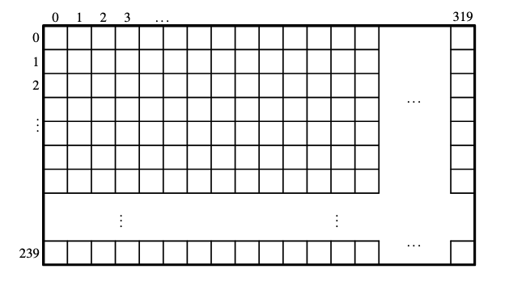
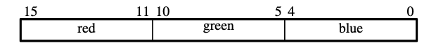

# VGA display

The onboard VGA controller has a memory mapped pixel buffer. From memory address `0xc8000000` to `0xc803ffff`.

- The screen itself is 320 pixels wide and 240 pixels high.

- Each pixel is represented as a 16 bit value (2 bytes or halfword) in RGB565
    - Red: 5 bits (bit 15 to bit 11)
    - Green: 6 bits (bit 10 to bit 5)
    - Blue: 5 bits (bit 4 to bit 0)

- pixels are addressed in the pixel buffer by
  using the combination of a base address and an x,y offset.
    - Base address `0xC8000000`
    - Pixel (1,1): `00000001 000000001 0`
    - Pixel (1,0): `00000000 000000001 0`
    - Pixel (0,1): `00000000 000000001 0`
    - Pixel (2,1): `00000001 000000002 0`
- So to write to a pixel:

```assembly
  .global _start
  _start:
    LDR R2, =0xC8000000 //base-address
    MOV R1, #2 // y-coordinate
    MOV R0, #1 // x-coordinate
    LDR R3, =0x0000 // Load r3 with color black
    ADD R2, R2, R1, LSL #10 //Add y coordinate shifted 10 to the left to base-address
    ADD R2, R2, R0, LSL #1 // Add x coordinate shifted 1 to base-address+y-coordinate
    STRH R3, [R2] // Write color to address in r2, (writes half word , 16 bits)
```

## Task - Wipe screen to black

Iterate over each row and column and set each pixel to black
See `CMP` and `BLT` instructions to do conditional jump

```assembly
CMP R0, #VARIABLE // If value in R0 is not less than value #VARIABLE, BLT will invoke a jump
BLT go_to_function
```

<details>
  <summary>Click for a solution</summary>

```assembly
.global _start

.equ VGA_BASE, 0xC8000000
.equ SCREEN_WIDTH, 320
.equ SCREEN_HEIGHT, 240
.equ BLACK, 0x0000

_start:
    BL clear_screen

main:
    B main

clear_screen:
  MOV R1, #0

clear_row:
  MOV R0, #0

clear_pixel:
  LDR R2, =VGA_BASE
  ADD R2, R2, R1, LSL #10
  ADD R2, R2, R0, LSL #1
  LDR R3, =BLACK
  STRH R3, [R2]
  ADD R0, R0, #1
  CMP R0, #SCREEN_WIDTH
  BLT clear_pixel
  ADD R1, R1, #1
  CMP R1, #SCREEN_HEIGHT
  BLT clear_row

  BX LR
```

</details>

## Task - Animate line appearing from left to right across the screen

- You need to first wipe the screen to black.
- In `_start` set up registers to store current x position to draw.
- In `main` call a subroutine to draw a pixel.
- Increment current x position
- Then call a delay subroutine.
- And then do a conditional branch to the top (to `main`).
- At the end reset x position and do an unconditional branch to `main`

<details>
  <summary>Click for a solution</summary>

```assembly
.global _start

.equ VGA_BASE, 0xC8000000
.equ SCREEN_WIDTH, 320
.equ SCREEN_HEIGHT, 240
.equ BLACK, 0x0000
.equ POS_X, 0
.equ POS_Y, 10
.equ COLOR, 0xFFAA

_start:
  BL clear_screen
  MOV R0, #POS_X
  MOV R1, #POS_Y
  LDR R3, =COLOR

main:
  BL draw_pixel
  BL delay
  ADD R0, R0, #1
  CMP R0, #SCREEN_WIDTH
  CMP R0, #SCREEN_WIDTH
  BLT main

  MOV R0, #POS_X
    B main

draw_pixel:
  LDR R2, =VGA_BASE
  ADD R2, R2, R1, LSL #10
  ADD R2, R2, R0, LSL #1
  STRH R3, [R2]
  BX LR

clear_screen:
  MOV R1, #0

clear_row:
  MOV R0, #0

clear_pixel:
  LDR R2, =VGA_BASE
  ADD R2, R2, R1, LSL #10
  ADD R2, R2, R0, LSL #1
  LDR R3, =BLACK
  STRH R3, [R2]
  ADD R0, R0, #1
  CMP R0, #SCREEN_WIDTH
  BLT clear_pixel
  ADD R1, R1, #1
  CMP R1, #SCREEN_HEIGHT
  BLT clear_row

  BX LR

delay:
  PUSH {R4}
  LDR R4, =0xffff

delay_loop:
  SUBS R4, R4, #1
  BNE delay_loop
  POP {R4}
  BX LR
```

</details>

## Task - Alternate color of line

Try alternate between two colors.

- Define another color
- Use another register to hold a flag that is eiter 1 or 0, see `EOR R5, R5, #1` to alternate flag between 1 and 0.
- Use `CMP R5, #0` to compare flag, which lets you branch `BEQ use_alternate_color`.

```assembly
    ...
  LDR R3, =COLOR
  EOR R5, R5, #1
  CMP R5, #0
  BEQ use_color
  B main

use_color:
  LDR R3, =COLOR2
  B main
```

Which would be similar to

```c
color=COLOR
flag = flag + 1 % 1
if (flag === 0) {
    color = COLOR2
}
```

<details>
  <summary>Click for a solution</summary>

```assembly
.global _start

.equ VGA_BASE, 0xC8000000
.equ SCREEN_WIDTH, 320
.equ SCREEN_HEIGHT, 240
.equ BLACK, 0x0000
.equ POS_X, 0
.equ POS_Y, 10
.equ COLOR, 0xFFAA
.equ COLOR2, 0x1111

_start:
  BL clear_screen
  MOV R0, #POS_X
  MOV R1, #POS_Y
  LDR R3, =COLOR
  MOV R5, #0

main:
  BL draw_pixel
  BL delay
  ADD R0, R0, #1
  CMP R0, #SCREEN_WIDTH
  BLT main
  MOV R0, #POS_X

  LDR R3, =COLOR
  CMP R5, #0
  EOR R5, R5, #1
  BEQ use_color

  B main

use_color:
  LDR R3, =COLOR2
  B main

draw_pixel:
  LDR R2, =VGA_BASE
  ADD R2, R2, R1, LSL #10
  ADD R2, R2, R0, LSL #1
  STRH R3, [R2]
  BX LR

clear_screen:
  MOV R1, #0

clear_row:
  MOV R0, #0

clear_pixel:
  LDR R2, =VGA_BASE
  ADD R2, R2, R1, LSL #10
  ADD R2, R2, R0, LSL #1
  LDR R3, =BLACK
  STRH R3, [R2]
  ADD R0, R0, #1
  CMP R0, #SCREEN_WIDTH
  BLT clear_pixel
  ADD R1, R1, #1
  CMP R1, #SCREEN_HEIGHT
  BLT clear_row

  BX LR

delay:
  PUSH {R4}
  LDR R4, =0xffff

delay_loop:
  SUBS R4, R4, #1
  BNE delay_loop
  POP {R4}
  BX LR
```

</details>

### Task - Make line thicker

Line is 1px high, modify code to draw it 20 pixel high.

- call a `draw_colum` subroutine that increments y position 20 times, for each loop call `draw_pixel`
- At this point you have a subroutine calling another subroutine, and you might want to store the **Link register** on the stack, which holds the address that should be continued from after subroutine completes.

```assembly
draw_column:
  PUSH {LR}
  BL draw_pixel
  POP {LR}
    ...
  BX LR
```

<details>
  <summary>Click for a solution</summary>

```assembly
.global _start

.equ VGA_BASE, 0xC8000000
.equ SCREEN_WIDTH, 320
.equ SCREEN_HEIGHT, 240
.equ BLACK, 0x0000
.equ POS_X, 0
.equ POS_Y, 50
.equ LINE_HEIGHT, 20
.equ COLOR, 0xFFAA
.equ COLOR2, 0x1111

_start:
  BL clear_screen
  MOV R0, #POS_X
  MOV R1, #POS_Y
  LDR R3, =COLOR
  MOV R5, #0

main:
  BL draw_column
  BL delay
  ADD R0, R0, #1
  MOV R1, #POS_Y
  CMP R0, #SCREEN_WIDTH
  BLT main
  MOV R0, #POS_X
  MOV R1, #POS_Y

  LDR R3, =COLOR
  EOR R5, R5, #1
  CMP R5, #0
  BEQ use_color

  B main

use_color:
  LDR R3, =COLOR2
  B main

draw_column:
  PUSH {LR}
  BL draw_pixel
  POP {LR}
  ADD R1, R1, #1
  CMP R1, #POS_Y + LINE_HEIGHT
  BLT draw_column
  BX LR

draw_pixel:
  LDR R2, =VGA_BASE
  ADD R2, R2, R1, LSL #10
  ADD R2, R2, R0, LSL #1
  STRH R3, [R2]
  BX LR

clear_screen:
  MOV R1, #0

clear_row:
  MOV R0, #0

clear_pixel:
  LDR R2, =VGA_BASE
  ADD R2, R2, R1, LSL #10
  ADD R2, R2, R0, LSL #1
  LDR R3, =BLACK
  STRH R3, [R2]
  ADD R0, R0, #1
  CMP R0, #SCREEN_WIDTH
  BLT clear_pixel
  ADD R1, R1, #1
  CMP R1, #SCREEN_HEIGHT
  BLT clear_row

  BX LR

delay:
  PUSH {R4}
  LDR R4, =0xFFFF

delay_loop:
  SUBS R4, R4, #1
  BNE delay_loop
  POP {R4}
  BX LR
```

</details>
